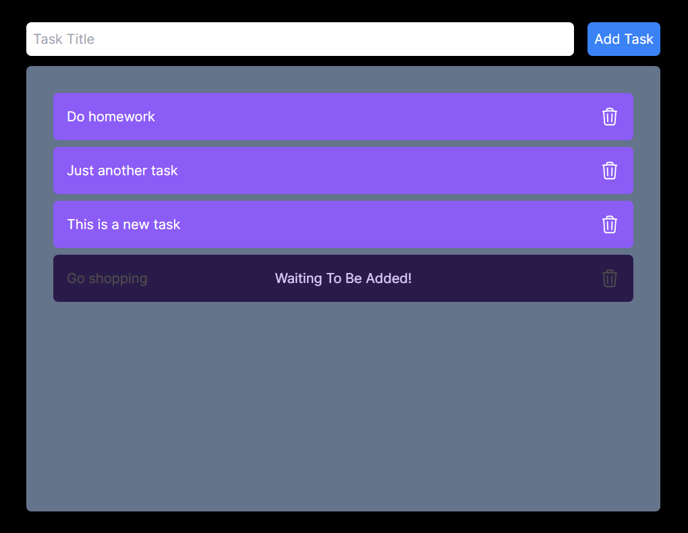

# ToDo App with Smart Contract

Here, I am attempting to create a Todo app using a smart contract.

To use this app, you have to install the MetaMask extension on your browser and select the Sepolia network. You can obtain Ethereum Sepolia faucet [here](https://sepoliafaucet.com/).

## Smart Contract

You can find the contract in the `smart-contract` folder, along with its ABI in the `build` folder. To use it locally, you first need to deploy it on any network of your choice. Here, I am using the Sepolia testnet. After deploying, add the contract address to your `.env` file, following the example in the `.env.example`.

## App: Adding a New Task

